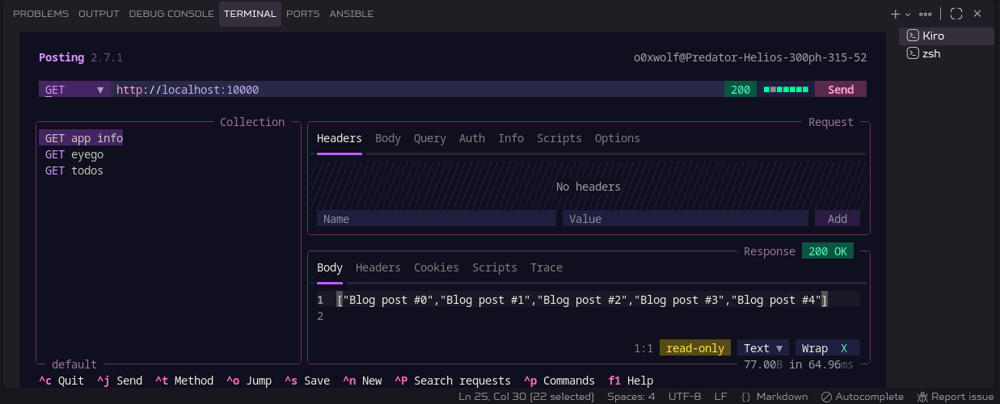
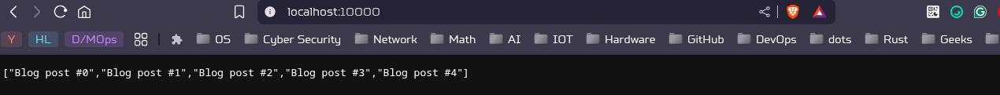
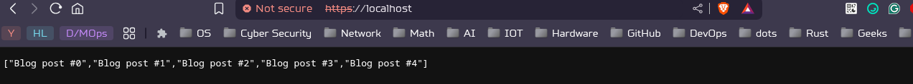
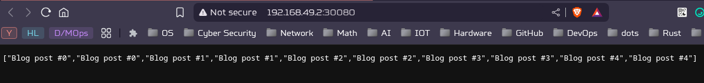
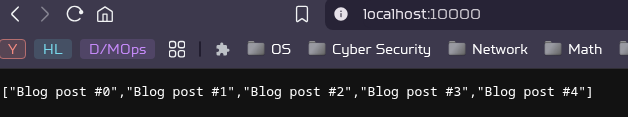
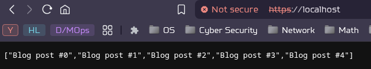

# 3-Tier Blog API System

A containerized 3-tier web application consisting of:
1. **Backend API** (Go) - serves REST responses with blog titles
2. **Database** (MySQL) - stores blog data  
3. **Proxy** (Nginx) - exposes API over HTTPS

### Architecture

```
Client → Nginx (HTTPS) → Backend API (Go) → MySQL Database
```

### File structure

```bash
├── backend
│   ├── db-password.txt
│   ├── docker-compose.yaml
│   ├── Dockerfile
│   ├── go.mod
│   ├── go.sum
│   ├── main.go
│   └── README.md
├── docker-compose.yaml
├── git-push.sh
├── imgs
│   ├── 1.png
│   ├── 2.png
│   ├── 3.png
│   └── 4.png
├── k8s
│   ├── backend_deployment.yaml
│   ├── backend_service.yaml
│   ├── database_deployment.yaml
│   ├── db-data-pvc.yaml
│   ├── db-data-pv.yaml
│   ├── db-secret.yaml
│   ├── db-service.yaml
│   ├── nginx-configmap.yaml
│   ├── proxy_deployment.yaml
│   ├── proxy_nodeport.yaml
│   └── README.md
├── nginx
│   ├── Dockerfile
│   ├── generate-ssl.sh
│   ├── nginx.conf
│   └── README.md
├── project1.pdf
└── README.md

5 directories, 30 files
```

---

### Test Docker Backend Image

read the `README.md` in the [**`backend`**](./backend/)

---

### Test Docker Compose

```bash
$ docker compose up -d

$ curl http://localhost:10000

["Blog post #0","Blog post #1","Blog post #2","Blog post #3","Blog post #4"]
```



---

### Build and Push nginx image

- read the `README.md` in the [**`nginx`**](./nginx/) To build and push the image

```bash
docker compose up -d
```


---

### Deploy To K8s Cluster

read the `README.md` in the [**`k8s`**](./k8s/) to deploy
> I'm using `minikube`




---

### Task 2 (optional)

Create docker compose ([**`docker-compose-networks.yaml`**](./docker-compose-networks.yaml)) setup with 3 separate networks for each container and make them communicate with each other(They can see each other) with their names, without a shared network

#### run:

```bash

docker compose -f docker-compose-networks.yaml up
# OR
docker compose -f docker-compose-networks.yaml up -d 
```



#### clean:

```bash
docker compose -f docker-compose-networks.yaml down
```

#### How it works:

- Three Separate Networks
  - `db-network`: Only mysql-db container
  - `backend-network`: Only go-backend container  
  - `nginx-network`: Only nginx container

- Each container is completely isolated in its own network. no direct container-to-container communication.

- Containers Communicate Through the Host Gateway
  - ```
     extra_hosts:
     - "go-backend:172.17.0.1"  # Maps service name to Docker host IP
     - "db:172.17.0.1"
    ```
  - `172.17.0.1` is Docker's default bridge gateway IP on Linux
  - This allows containers to resolve service names to the host IP

#### Communication Flow

- **nginx config**: server `go-backend:10000;`
- **DNS resolution**: `go-backend` → `172.17.0.1` (via extra_hosts)
- **Connection:** nginx connects to `172.17.0.1:10000`
- **Host routing**: Docker host routes `:10000` → `Test-GoApp:8000`
- **Response:** Go app responds back through the same path

#### Network Architecture

```bash
┌─────────────────┐    ┌─────────────────┐    ┌─────────────────┐
│   nginx-proxy   │    │   Test-GoApp    │    │   mysql-db      │
│  (nginx-network)│    │(backend-network)│    │  (db-network)   │
└─────────────────┘    └─────────────────┘    └─────────────────┘
         │                       │                       │
         │                       │                       │
    ┌────▼────┐             ┌────▼────┐             ┌────▼─────┐
    │nginx-net│             │backend- │             │db-network│
    │172.30.x │             │net      │             │172.28.x  │
    │         │             │172.29.x │             │          │
    └─────────┘             └─────────┘             └──────────┘
         │                       │                       │
         └───────────────────────┼───────────────────────┘
                                 │
                        ┌────────▼─────────┐
                        │  Docker Host     │
                        │   172.17.0.1     │
                        │                  │
                        │ Port Mappings:   │
                        │ :80 → nginx:80   │
                        │ :443→ nginx:443  │
                        │ :10000→ go:8000  │
                        │ :3306→ mysql:3306│
                        └──────────────────┘
```